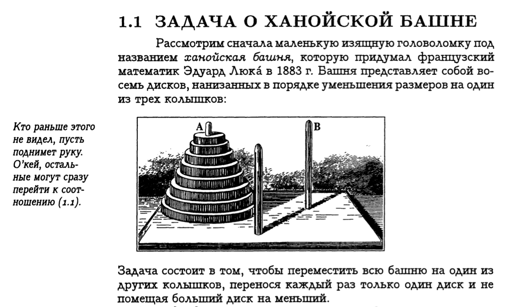

# Размер задач. Задача о ханойской башне

## Вступление

Мы продолжаем знакомство с концепцией размера задачи, и переходим от бинарного поиска из вступительной лекции CS50 к задаче о Ханойской Башне, изложенной в "Конкретной Математике" Кнута.

## Задача о ханойской башне




### Описание задачи

Есть три стержня. На первый нанизана упорядоченная пирамидка из N дисков, так что внизу — самый крупный, вверху — самый маленький. Единственная допустимая операция — перекладывание диска с одного стержня на другой. Больший диск положить класть сверху на меньший запрещается. Цель задачи — перенести пирамидку целиком с одного диска на другой за минимальное количество операций (перекладывания диска).

На примере этой задачи хотелось бы не только продолжить рассмотрение концепций размера задачи, сложности алгоритма и рекурсии/реккурентности, но и проиллюстрировать процесс выработки алгоритма и структуры данных, необходимых для формального (то есть доступного для кодирования) решения задачи.


### Первые попытки решения задачи

Практически для всех задач, параметризированных по их размеру (в нашем случае дисков может быть любое натуральное N) полезно начать с попыток определения тривиальных решений для малых N. В нашем случае начнём с ответа на простой вопрос: сколько и каких операций необходимо для перекладывания пирамидки из одного единственного диска с первого стержня на третий?


#### Решение задачи для случая с одним единственным диском (N = 1)

 Ответ, конечно, очевиден: переложить нужно этот один единственный диск. Как мы его запишем? Давайте сразу начнём использовать английский в наших записях. `Move` значит "подвинуть, переместить" — так и назовём нашу первую функцию. Перемещаем мы диск со стержня на стержень — стало быть, у функции должно быть два параметра.

```javascript
move(1, 3) // может быть, стоит записывать операцию переноса диска с первого стержня на третий так?
move(departure_rod, destination_rod) // а обобщённо, со стержня departure_rod на стержень destination_rod — так?
// выглядит неплохо
// кстати, "departure" по-английски — "отправление", "destination" — "назначение",
// эти слова вы могли видеть в аэропорту или на вокзале
// а "rod", разумеется, переводится как "стержень"
```

Помимо атомарной операции перемещения, у нас ещё есть собственно решение задачи целиком. Назовём эту функцию `solve_hanoi` — "решить (задачу) ханой(-ской башни)". Какие у неё могут быть аргументы? Как минимум, высота башни — N. А каково само решение? Пока не ясно в общем случае, но уже понятно что делать для случая с единственным диском: просто переложить его, не мудрствуя лукаво.

```javascript
function solve_hanoi(N) {
    if (N == 1) {
        move(1, 3);
        // заметим, что функция `move` у нас до сих пор толком не определена
        // мы пока не столько пишем код, сколько размышляем и пытаемся нащупать решение
    }
}
```

Минуточку, а почему это мы перемещаем пусть даже единственный диск именно *с первого стержня на третий*? Ведь задача может быть сформулирована и для пирамидки, изначально расположенной, например, на втором стержне, или для переноса её не на третий, а на второй стержень! Выходит, надо добавить параметров: объявление `solve_hanoi(N)` превратится в `solve_hanoi(N, departure_rod, destination_rod)`, а определение будет следующим:

```javascript
function solve_hanoi(N, departure_rod, destination_rod) {
    if (N == 1) {
        move(departure_rod, destination_rod);
        // изменилось только лишь то, что мы заменили константы 1 и 3
        // на параметры departure_rod и destination_rod
    }
}
```

Здорово, конечно, но и функцию move надо бы определить. Как будем хранить данные? Нам нужно знать а) какие диски лежат на каком стержне и б) в каком порядке. А самих стержней — три. Вполне подойдёт массив из трёх элементов, как-то описывающих состояние стержня (количество и порядок дисков на нём). Количество и порядок дисков тоже вполне неплохо представить в виде массива. Для исходного условия задачи с одним единственным диском получим такую конструкцию: `[[1], [], []]`, а решением её должно будет стать `[[], [], [1]]` — единственный диск перенесён с первого стержня на второй. Структура данных диктует нам алгоритм: функция `move` должна переводить одно состояние в другое. Само состояние давайте пока считать глобальным. Немного подумав, можно записать полученный подход таким псевдокодом:

```javascript
hanoi_1 = [ // начальное состояние для задачи с одним единственным диском
    [1], // на первом стержне лежит наш диск
    [], // второй стержень пуст
    [] // третий — тоже
]

function move(departure_rod, destination_rod) {
    // 1. снять диск со стержня departure_rod
    // (то есть удалить его из массива hanoi_1[departure_rod])
    // 2. положить снятый диск на destination_rod
    // (то есть добавить его к массиву hanoi_1[destination_rod])
}
```

Возникает вопрос как именно снимать и класть диски — то есть, как именно добавлять или удалять элементы из массива в используемом языке. Это вопрос реализации, и в используемом нами языке JavaScript у массивов есть свои методы. В нашем простейшем случае мы можем обойтись даже тупой заменой массива, представляющего стержень:

```javascript

function move(departure_rod, destination_rod) {
    hanoi_1[departure_rod] = []
    hanoi_1[destination_rod] = [1]
    // тупо донельзя, но для задачи размера 1 — сойдёт и так
}
``` 

Выглядит откровенно хреново? Так и есть, отрицать не будем. Но мы ведь занимаемся поиском решения, а не его оптимизацией — до оптимизации ещё дойдём. Мы даже можем запустить в консоли этот код — и он сработает: `solve_hanoi(1, 1, 3)`. Но давайте перейдём к случаю с двумя дисками.


#### Решение задачи для случая с двумя дисками (N = 2)

Воспользуемся полученным на предыдущем шаге форматом данных, и опишем исходное условие и желаемый результат:

```javascript
// исходное состояние для N = 2
hanoi_2 = [[1, 2], [], []]
// желаемый результат
hanoi_2_desired_result = [[], [], [1, 2]]
```

На первом стержне у нас уже два диска, в первом массиве — два объекта. Логично их пронумеровать: первый диск и второй, мы так и поступили. Нужно учесть порядок дисков: давайте считать, что первой цифре в массиве соответствует самый верхний диск, а последней — самый нижний. Можем ли мы поступить наоборот? Да запросто, лишь бы этот порядок соблюдался для всех стержней, и учитывался при перемещений (брать можно всегда только самый верхний диск).

Вспомним, какие у нас есть ограничения для операции перекладывания диска? Во-первых, мы всегда обязаны брать самый верхний диск. Значит, если верхний диск мы договорились представлять первой цифрой массива, массив "отправления" покидать должна всегда именно она. Во-вторых, запрещено класть больший диск сверху на больший — значит, перед перекладыванием нам стоит проверить, не находится ли наверху целевого стержня диск меньше, чем на исходном. Состояние, которое запрещено правилами (постановкой задачи) будем называть запрещённым состоянием. Запрещёнными состояниями для задачи размера N = 2 являются [[2,1], [], []] и два аналогичных на других стержнях: [[], [2, 1], []], [[], [], [2,1]] — все в силу того, что болший (второй) диск лежит сверху на меньшем.

Давайте изменим функцию `move` так, чтобы она удовлетворяла нашим правилам. Сначала без проверки, само действие перекладывания:

```javascript
function move(departure_rod, destination_rod) {
    top_disk = hanoi_2[departure_rod].shift() // снимаем диск сверху со стержня departure_rod
    hanoi_2[destination_rod].unshift(top_disk) // кладём его сверху на стержень destination_rod
}
```

Мы использовали встроенные методы работы с массивами JavaScript `shift` и `unshift`. Они делают как раз то, что нам нужно: первая забирает элемент из начала массива, вторая — напротив, добавляет элемент в начало массива. В рамках используемой метафоры так и получается: сняли диск, положили диск. Можно, кстати, обойтись и без промежуточной переменной `top_disk` ("верхний диск"), и записать сразу такое выражение: `hanoi_2[destination_rod].unshift(hanoi_2[departure_rod].shift())` — но мы так выпендриваться пока не будем, читается оно ощутимо хуже. Преждевременная оптимизация — корень многих зол, нам пока важнее понимать, что мы делаем — а не делать это очень быстро и эффективно.

Добавим проверку? А давайте вынесем её в отдельную функцию, она ведь имеет самостоятельным смысл. Назовём, скажем `is_move_possible` — "возможно ли перемещение"? Заодно и игра слов красивая проявится — "move"-то по-английски ещё и "ход" (в игре) обозначает. Ваш ход, господин программист.
Давайте подумаем. Мы точно можем переложить любой диск на пустой стержень, и мы точно можем переложить диск на стержень, верхний диск на котором больше перекладываемого. В остальных случаях мы, похоже, будем нарушать правила. Ещё момент: с уже пустого стержня мы ничего никуда переложить не можем — ну нечего же перекладывать =) Закодируем!

```javascript
function is_move_possible(departure_rod, destination_rod) {
    if (departure_rod.length == 0) {
        // если исходный стержень пуст, перекладывать нечего — ход запрещён
        return false;
    }
    // до этой точки в коде мы дойдём только если исходный стержень не пуст
    if (destination_rod.length == 0) {
        // если целевой стержень пуст, а перекладывать есть что — ход вполне неплох!
        return true;
    }
    // до этой точки мы дойдём только если как исходный, так и целевой стержни не пусты
    // ход возможен, если на целевом стержне верхний диск больше (по номеру), чем на исходном
    return destination_rod[0] > departure_rod[0];
}
```

Честно говоря, понадобится ли нам эта функция на практике — вопрос; верно описанный алгоритм должен бы учитывать "правила игры" сам. Но полезна она уже хотя бы для углубления понимания происходящего, как любой пример. Пока что давайте добавим `is_move_possible` как проверку в нашей функции `move`:

```javascript
function move(departure_rod, destination_rod) {
    // ранее описанные действия по перекладыванию диска будем выполнять только если это разрешено правилами
    if (is_move_possible(departure_rod, destination_rod)) {
        top_disk = hanoi_2[departure_rod].shift() // снимаем диск сверху со стержня departure_rod
        hanoi_2[destination_rod].unshift(top_disk) // кладём его сверху на стержень destination_rod
    }
}
```

Надо сказать, что дальнейший рост размера задачи (N = 3, 4, ... сколько угодно) усложнения `move` и тем более `is_move_possible` не потребует, так что теперь можно сконцентрироваться на `solve_hanoi` — действительном решении задачи. Для случая с одним диском нам требовалось всего лишь переложить один диск. Напомним себе, что код выглядел так (я просто скопировал его сверху без изменений):

```javascript
function solve_hanoi(N, departure_rod, destination_rod) {
    if (N == 1) {
        move(departure_rod, destination_rod);
    }
    if (N == 2) {
        // а вот здесь стоит подумать:
        // какие именно перемещения нам необходимы для переноса пирамидки из двух дисков?
    }
}
```

Оторвёмся на секунду от кода. Представим три стержня, на первом — лежит пирамидка из двух дисков, меньший (#1) сверху на большем (#2). Как перенести пирамидку на третий стержень за минимальное количество действий, ни разу не положив большой диск сверху на маленький? Вроде бы несложно: переложим маленький диск на второй стержень, затем большой диск на третий (целевой) стержень, и затем со второго стержня маленький диск на третий. Всего три операции, красота. Важно заметить, однако, что у нас в работу вступил второй диск — назовём его промежуточным, "intermediate" (хотя в рамках метафоры аэропорта можно было бы назвать и трансферным, но метафоры стоит вовремя притормаживать). Как понять, какой стержень можно считать промежуточным? Очень просто — тот, который остаётся, когда из трёх имеющихся выберут исходный (departure) и целевой (destination). Иными словами, когда из `[1, 2, 3]` уже забрали `1` и `3` — остаётся только `2`, а если заберут `2` и `3` — останется только `1`. Остаётся добавить поправку на нумерацию стержней с нуля в нашем случае (мы ведь используем массив), и закодировать:

```javascript
function get_intermediate_rod(departure_rod, destination_rod) {
    // исходный массив стержней — просто три цифры
    all_rods = [0, 1, 2]
    
    // отфильтруем departure_rod встроенной функцией
    rods_without_departure = all_rods.filter(function (rod) { return rod != departure_rod })
    
    // отфильтруем destination_rod встроенной функцией
    only_one_rod_left = rods_without_departure.filter(function (rod) { return rod != destination_rod })
    
    // в all_rods должен к этому моменту остаться только один элемент,
    // его и вернём как номер промежуточного стержня:
    return only_one_rod_left[0]
}
```

Умея получать промежуточный стержень, мы можем сформулировать решение для N = 2:

```javascript
function solve_hanoi(N, departure_rod, destination_rod) {
    if (N == 1) {
        // просто перекладываем один диск
        move(departure_rod, destination_rod);
    }
    if (N == 2) {
        // определим, какой стержень остался для промежуточных действий,
        // учитывая указанные исходный и целевой стержни
        intermediate_rod = get_intermediate_rod(departure_rod, destination_rod)

        // перекладываем маленький диск на промежуточный стержень
        move(departure_rod, intermediate_rod)
        
        // перекладываем большой диск на целевой стержень
        move(departure_rod, destination_rod)
        
        // маленький диск с промежуточного стержня перекладываем на целевой
        move(intermediate_rod, destination_rod)
    }
}
```

Выглядит неплохо, должно работать. Но как бы расширить решение на случай N = 3, а лучше — вообще для любого N?


#### Решение задачи для случая с тремя дисками (N = 3)

Для случая с тремя дисками решение становится уже сложнее: действий больше, в голову сразу все могут и не поместиться, да и что делать — не так уж с ходу и понятно. Дисков всего три, а задачка-то получается уже большая. Что нам в таком случае может посоветовать программист, математик, или толковый римский император? "Разделяй и властвуй!" — вот что. Нужно попробовать свести большую задачу к такой же, но меньшей. То есть, свести задачу для пирамидки из трёх дисков к задаче для пирамидки из двух. Для каких из двух? Ну например для двух верхних. Можем мы переложить два верхних диска, соблюдая все правила? Да как нефиг делать, мы же в предыдущем разделе как раз этим занимались. Обязаны мы перекладывать на третий стержень, или можем и на второй тоже? Не обязаны, на какой захотели — на тот и переложили. То есть, мы можем получить из исходного состояния `[[1, 2, 3], [], []]` за три действия (см. алгоритм для N == 2) состояние `[[3], [1,2], []]` вызвав `solve_hanoi(2, 0, 1)` (параметры расшифровываются так: перекладываем 2 диска, со стержня с номером 0 на стержень с номером 1, в привычно-человеческой нумерации — с самого левого, стартового стержня, на средний (промежуточный)). Уже неплохо — мы задействовали решение задачи для меньшего размера в рамках решения для большего, это — явно шаг в верном направлении. К тому же, мы сформулировали действие "переложить верхнюю часть пирамиды из M дисков", причём M у нас равно (N-1) — первым параметром в `solve_hanoi` мы передаём ведь именно размер задачи (то есть количество дисков для перекладывания).
Из состояния `[[3], [1,2], []]` перейти ещё на шаг ближе к цели (а цель у нас `[[], [], [1,2,3]]`) — просто, нужно всего лишь переложить третий диск на третий стержень: `[[], [1,2], [3]]`, это атомарная операция `move(0, 2)` (стержни нумеруются с нуля, помним?). Теперь у нас самый большой диск на третьем стержне, пирамидка из двух оставшихся — на втором, первый — пуст. Умеем мы перекладывать пирамидку из двух со стержня на стержень? Умеем! Имеет ли значение, что на этом стержне уже есть диск? Покуда диск больше, чем самый крупный диск перекладываемой пирамидки — нет, не имеем. Так давайте сделаем из `[[], [1,2], [3]]` наше искомое `[[], [], [1,2,3]]` простым вызовом `solve_hanoi(2, 1, 2)`. Задачка-то — того, решена! Давайте выпишем из нашего слегка сумбурного объяснения суть: те операции, которые мы выполнили.

```javascript
// N = 3, начинаем с исходной:
hanoi = [[1,2,3], [], []]

// переносим верхнюю пирамидку с первого диска на второй (промежуточный)
// задействуем уже имеющееся решение для N = 2
// [[1, 2, 3], [], []] => [[3], [1,2], []]
solve_hanoi(2, 0, 1)

// переносим оставшийся на левом стержне самый крупный диск на правый
// [[3], [1,2], []] => [[], [1,2], [3]]
move(0, 2)

// переносим пирамидку из двух дисков с промежуточного стержня на целевой
// снова задействуем уже имеющееся решение для N = 2
// [[], [1,2], [3]] => [[], [], [1, 2, 3]]
solve_hanoi(2, 1, 2)
```

Добавим код на случай N = 3 в нашу функцию `solve_hanoi`:

```javascript
function solve_hanoi(N, departure_rod, destination_rod) {
    if (N == 1) {
        // просто перекладываем один диск
        move(departure_rod, destination_rod);
    }

    if (N == 2) {
        // определим, какой стержень остался для промежуточных действий,
        // учитывая указанные исходный и целевой стержни
        intermediate_rod = get_intermediate_rod(departure_rod, destination_rod)

        // перекладываем маленький диск на промежуточный стержень
        move(departure_rod, intermediate_rod)
        
        // перекладываем большой диск на целевой стержень
        move(departure_rod, destination_rod)
        
        // маленький диск с промежуточного стержня перекладываем на целевой
        move(intermediate_rod, destination_rod)
    }

    if (N == 3) {
        // определим, какой стержень остался для промежуточных действий,
        // учитывая указанные исходный и целевой стержни
        intermediate_rod = get_intermediate_rod(departure_rod, destination_rod)

        // перекладываем верхнюю пирамидку из 2 дисков на промежуточный стержень
        solve_hanoi(2, departure_rod, intermediate_rod)
        
        // перекладываем самый большой диск на целевой стержень
        move(departure_rod, destination_rod)
        
        // пирамидку с промежуточного стержня перекладываем на целевой
        solve_hanoi(2, intermediate_rod, destination_rod)
    }
}
```

Очевидна схожесть веток для N = 2 и N = 3. И там и там три действия: положить на промежуточный стержень, перенести на целевой стержень самый крупный диск, перенести с промежуточного стержня на целевой. Отличается лишь то, что в N = 3 мы перекладываем на промежуточный диск пирамидку, а для N = 2 — одиночный диск. Но ведь пирамидка из одного диска — это и есть сам диск, значит для N = 2 мы делаем то же самое, что и для N = 3! Давайте упростим код (попросту выкинув ветку N = 2, она нам больше не нужна — у нас есть общее решение!) Единственное, что нужно учесть — что `2 == 3 - 1` =)

```javascript
function solve_hanoi(N, departure_rod, destination_rod) {
    if (N == 1) {
        // просто перекладываем один диск
        move(departure_rod, destination_rod);
    }
    // для всех N > 1
    else {
        // определим, какой стержень остался для промежуточных действий,
        // учитывая указанные исходный и целевой стержни
        intermediate_rod = get_intermediate_rod(departure_rod, destination_rod)

        // перекладываем верхнюю пирамидку из 2 дисков на промежуточный стержень
        solve_hanoi(N - 1, departure_rod, intermediate_rod)
        
        // перекладываем самый большой диск на целевой стержень
        move(departure_rod, destination_rod)
        
        // пирамидку с промежуточного стержня перекладываем на целевой
        solve_hanoi(N - 1, intermediate_rod, destination_rod)
    }
}
```

Ура, мы решили задачу. Кажется. Без проверки — нельзя быть уверенным ни в чём наверняка, так давайте проверять.

#### Проверка и отладка

TODO


### Реккурентная формула

TODO

#### Получение

TODO

#### Код

TODO

### Замкнутая форма

TODO

#### Получение

TODO

#### Код

TODO

### Конечный автомат

TODO